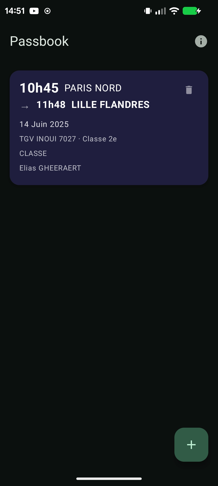
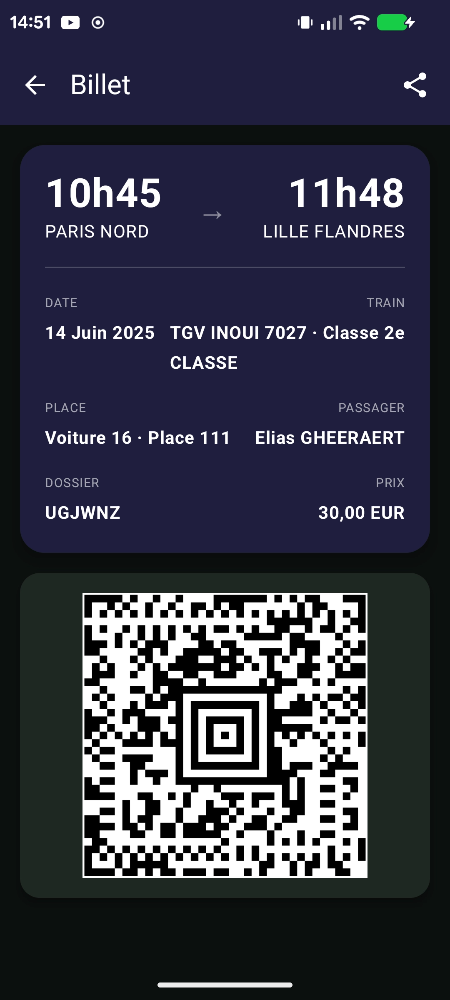
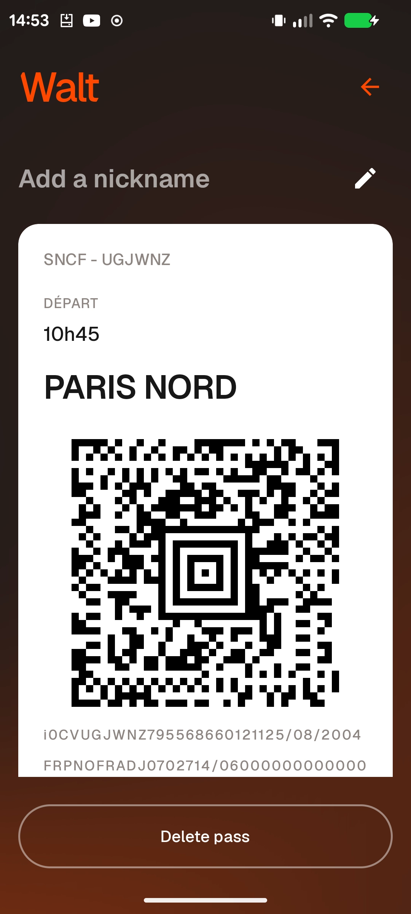

# Passbook

  <picture>
    <source media="(prefers-color-scheme: dark)" srcset="docs/assets/device-passbook-home.webp">
    
  </picture>
  <picture>
    <source media="(prefers-color-scheme: dark)" srcset="docs/assets/device-passbook-card.webp">
    
  </picture>
  <picture>
    <source media="(prefers-color-scheme: dark)" srcset="docs/assets/device-walt-card.webp">
    
  </picture>

Passbook is a free, open-source .pkpass generation app for SNCF train tickets for Android.

## Features

- Material 3 Expressive theming that follows your wallpaper and system colors.
- Convert SNCF train ticket PDF to Apple Wallet (.pkpass) format offline using on-device ML models
- Display the generated .pkpass into cards that match SNCF theming.
- Automatic self-signing of the generated .pkpass
- Simple exporting for the generated .pkpass to let other wallet app import it (Ex: Walt)

## Download

  <a href="https://github.com/Mashopy/Passbook/releases">
    <picture>
      <source media="(prefers-color-scheme: dark)" srcset="docs/assets/badge-github.webp" height="60">
      
    </picture>
  </a>

